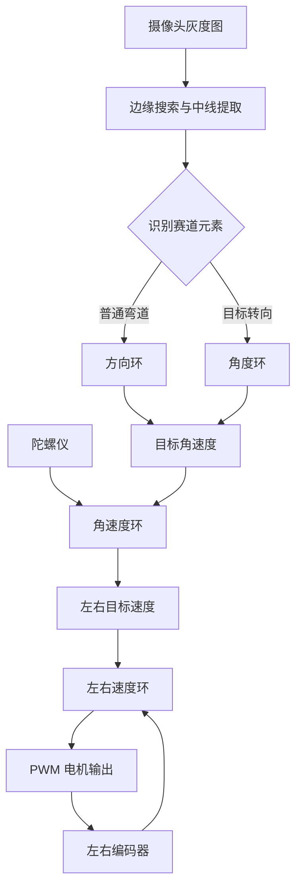

# TC387 Smart Car | Three Cascade Loop Control

<p align="center">
  
  
  
  
</p>

<p align="center"><strong>从赛道图像到电机 PWM 的分层闭环控制实现</strong></p>

中南大学 CrazyRoad 第 21 届智能车工程的三串级控制环版本。项目基于 AURIX TC387QP，围绕“方向/角度外环 + 角速度中环 + 速度内环”构建车辆控制系统，并配套摄像头赛道识别、路径规划和 VOFA 调试输出。

> <span style="color:#cf222e"><strong>这个仓库的重点</strong></span>：把控制问题拆成不同时间尺度的小问题，让每个环只负责自己擅长的任务，便于调试、解释和复用。

## 控制架构

```text
赛道偏差 / 目标偏航角
          │
          ▼
方向环或角度环（外环，约 200 Hz）
          │  输出目标角速度
          ▼
角速度环（中环，约 500 Hz）
          │  输出差速/速度修正
          ▼
左右速度环（内环，约 1 kHz）
          │
          ▼
编码器反馈 → PWM 电机输出
```

外环可在方向控制和目标偏航角控制之间切换；中环使用陀螺仪反馈；内环使用左右编码器实现速度闭环。

### 为什么采用串级结构

单一 PID 很难同时处理“看线误差、车身角速度和电机响应”这三种不同物理量。串级结构将它们分开：外环关注车辆应该朝哪里走，中环关注车身转得是否及时，内环关注左右车轮是否达到目标速度。这样可以缩短每个环的调参范围，并把传感器噪声隔离在更合适的层级。

| 控制环 | 输入 | 输出 | 典型周期 |
| --- | --- | --- | --- |
| 外环 | 赛道偏差或偏航角误差 | 目标角速度 | 5 ms / 200 Hz |
| 中环 | 目标角速度与陀螺仪角速度 | 左右轮速度修正 | 2 ms / 500 Hz |
| 内环 | 左右轮目标速度与编码器速度 | 左右轮 PWM | 1 ms / 1 kHz |



## 主要功能

- MT9V034 摄像头采集和赛道边缘处理
- 赛道中线提取、节点识别、十字/T 字/环岛处理
- 方向环、角度环、角速度环和左右速度环
- MPU6050/陀螺仪姿态解算
- 编码器测速、无刷电机 PWM 和舵机控制
- WiFi/蓝牙数传、TFT/OLED 调试显示
- VOFA FireWater 波形输出和串口调参接口
- 冲出赛道自动停车、节点调试和运行状态保护

## 硬件与开发环境

| 类别 | 配置 |
| --- | --- |
| MCU | Infineon AURIX TC387QP |
| 开发板 | 龙邱 LQ_TC387 核心板 + V7 通用母板 |
| IDE | AURIX Development Studio 1.10.x |
| 编译器 | Tasking TriCore Compiler |
| 下载调试 | DAP MiniWiggler / winIDEA |

## 工程结构

```text
lq_6_7/
├── Main/                  Cpu0~Cpu3 入口、配置和中断
├── Src/APP/               摄像头、电机、编码器、IMU 和外设应用
├── Src/Driver/            ADC、DMA、SPI、QSPI、UART、GTM/PWM
├── Src/User/              PID、路径规划、图像和元素识别算法
├── Libraries/             Infineon iLLD 与基础服务库
└── Configurations/        芯片启动及链接配置
```

## 关键文件

- `lq_6_7/Main/irq.c`：控制环调度、中断和调试命令
- `lq_6_7/Main/config.h`：功能开关及 PID 初始参数
- `lq_6_7/Src/User/LQ_PID.c`：位置式/增量式 PID 实现
- `lq_6_7/Src/APP/LQ_Track.c`：赛道和元素识别
- `lq_6_7/Src/APP/LQ_PWM_Moto.c`：电机状态和 PWM 控制
- `detect_t_by_jumps_reference.c`：T 字路口跳变检测参考代码

## 编译、调试与验证

1. 在 AURIX Development Studio 导入 `lq_6_7` 工程。
2. 检查 `Main/config.h`、引脚映射和链接脚本。
3. 先在静止或抬轮状态验证传感器、编码器和 PWM。
4. 依次调试速度环、角速度环，再调试方向/角度外环。
5. 低速上车测试，确认冲出赛道停车和人工停车均有效。

建议按“静态、抬轮、低速、全速”的顺序逐步放大测试范围，每一步都记录输入、输出和异常现象，避免将机械问题误判为 PID 参数问题。

## 调参建议

建议由内到外调试：先让左右速度环稳定跟踪，再加入角速度环，最后启用方向环或角度环。每次只改变少量参数，并记录速度、角速度、赛道偏差和 PWM 波形。

| 现象 | 优先检查 |
| --- | --- |
| 直道左右速度不一致 | 编码器方向、轮胎摩擦、速度环 Kp/Ki |
| 转弯响应慢 | 角速度环 Kp、陀螺仪量程和采样周期 |
| 高频左右摆动 | 外环 Kp 过大、图像中线抖动或延迟 |
| PWM 长时间打满 | 基础速度过高、限幅设置或内环积分累积 |
| 路口误判 | 二值化阈值、跳变检测窗口和元素状态机 |

## 文档索引

- [路口识别分析报告.md](路口识别分析报告.md)：路口特征、误判来源和识别思路
- [方法对比和集成方案.md](方法对比和集成方案.md)：候选算法的优缺点与组合方案
- [方案优化设计.md](方案优化设计.md)：工程化优化和参数建议
- [detect_t_by_jumps_reference.c](detect_t_by_jumps_reference.c)：T 字路口跳变检测参考实现

## 版本说明

本仓库对应 `workspace_6_8`，与 `smart-car-vofa` 是两个独立控制方案：本仓库突出三串级控制和算法验证，VOFA 仓库突出最终车辆工程和在线调参集成。

## 许可与致谢

工程包含龙邱 LQ_TC387 软件库和 Infineon iLLD。请遵守仓库内上游许可证、版权声明及相关硬件厂商授权条款。
